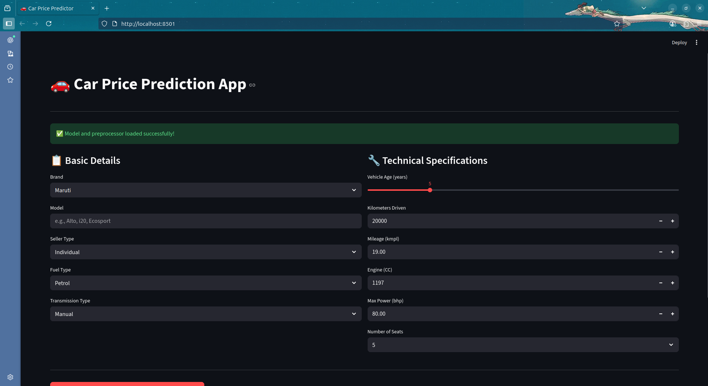
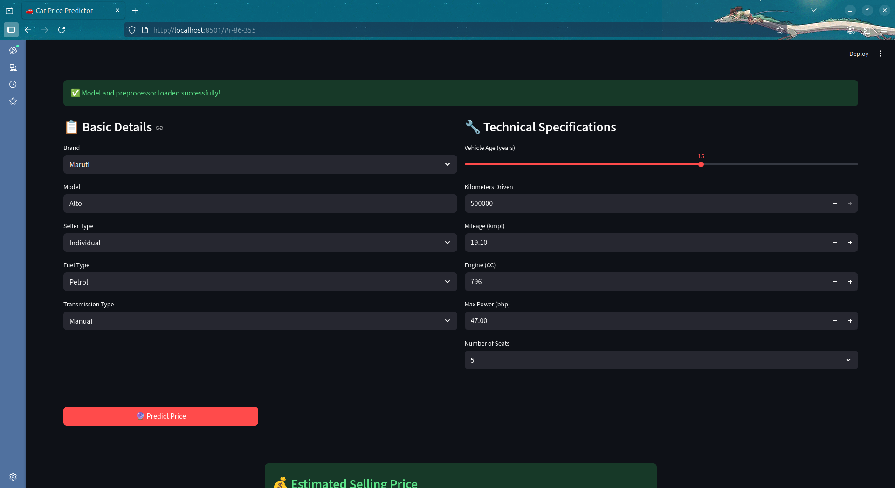
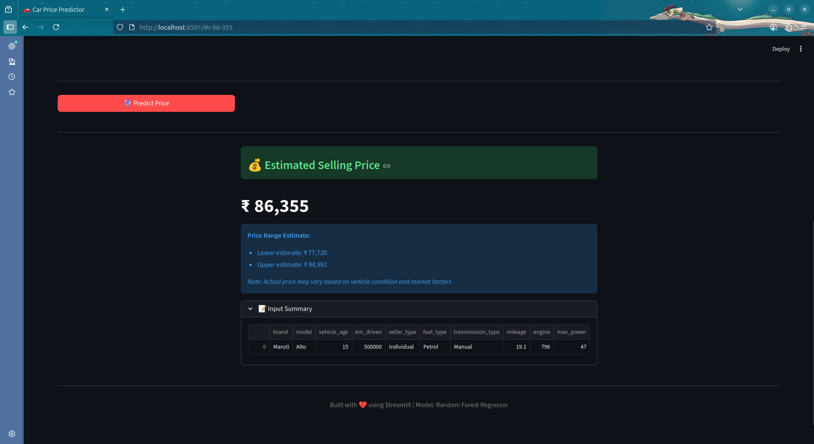

# 🚗 Car Price Prediction – CarDekho Dataset (with Streamlit) [](https://www.kaggle.com/datasets/manishkr1754/cardekho-used-car-data)

Hey there! Welcome to my car price playground 😎

Now you don't just train models — you can predict car prices live with a click of a button thanks to Streamlit.

## 🔹 What's Inside

### Data Exploration (EDA)
Checked out trends, distributions, and correlations — because guessing a car's price blindly is boring.

### Preprocessing
- Numeric columns scaled with `StandardScaler`
- Categorical columns one-hot encoded
- Wrapped in a Pipeline so preprocessing + prediction is smooth

### Models Tried
- **Linear Regression** → simple baseline
- **Random Forest Regressor** → handles non-linear patterns like a champ

### Streamlit App
- Input features live: brand, model, fuel type, transmission, etc.
- Get instant predicted price
- Interactive sliders for numeric inputs and dropdowns for categorical

## 🔹 How to Run

### 1. Clone the repo:
```bash
git clone https://github.com/donxav/CarPre.git
cd car-price-prediction
```

### 2. Create and activate virtual environment:
```bash
python -m venv venv
source venv/bin/activate  # On Windows: venv\Scripts\activate
```

### 3. Install dependencies:
```bash
pip install -r requirements.txt
```

### 4. Train the model:
```bash
python train_model.py
```

### 5. Run the Streamlit app:
```bash
streamlit run app.py
```

### 6. Open your browser:
Navigate to `http://localhost:8501` and start predicting! 🚀

## 📦 Requirements

```txt
pandas
numpy
scikit-learn
streamlit
joblib
matplotlib
seaborn
```


## 📊 Dataset

**Source**: [CarDekho Used Car Dataset](https://www.kaggle.com/datasets/manishkr1754/cardekho-used-car-data) on Kaggle

**Author**: Manish Kumar

**License**: Database: Open Database, Contents: Database Contents

**Description**: This dataset contains information about used cars from the Indian market. The used car market in India is a dynamic and ever-changing landscape where prices can fluctuate wildly based on various factors including the make and model of the car, its mileage, condition, and current market conditions.

### Features

- **car_name**: Car's full name (includes brand and specific model name)
- **brand**: Brand name of the particular car
- **model**: Exact model name of the car of a particular brand
- **seller_type**: Type of seller (Dealer/Individual)
- **fuel_type**: Fuel used in the car (Petrol/Diesel/CNG)
- **transmission_type**: Transmission used in the car (Manual/Automatic)
- **vehicle_age**: The count of years since car was bought
- **mileage**: Number of kilometers the car runs per liter
- **km_driven**: Total kilometers driven
- **engine**: Engine capacity in CC
- **max_power**: Maximum power in bhp
- **seats**: Number of seats
- **selling_price**: Selling price of the car (target variable)

### Tags

`Automobiles and Vehicles` · `Data Analytics` · `Exploratory Data Analysis` · `E-Commerce Services` · `Model Comparison`

**Citation**: If you use this dataset, please credit Manish Kumar and the original source on Kaggle.

## 🎯 Model Performance

- **Linear Regression**: Baseline model
- **Random Forest**: Best performance with R² score on test set

## 🖼️ Screenshots


!



## 🤝 Contributing

Feel free to fork this repo and submit pull requests. All contributions are welcome!

## 📝 License

This project is open source and available under the MIT License.

## 👨‍💻 Author

**Your Name**
- GitHub: [Xav Don](https://github.com/donxav)
- LinkedIn: [Don Xavier](https://linkedin.com/in/don-xavier72)

---

Made with ❤️ and lots of ☕